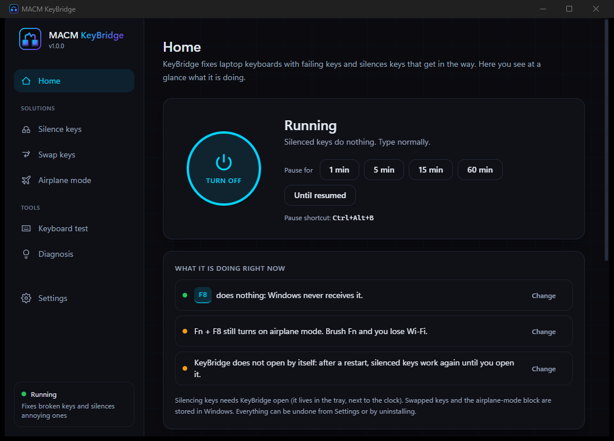
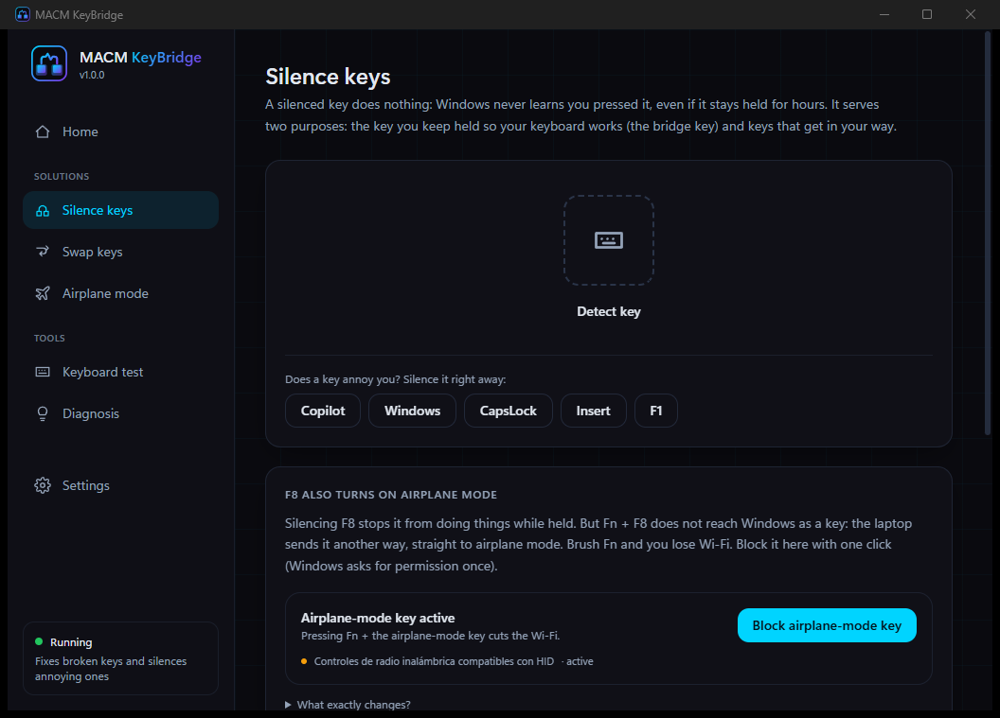
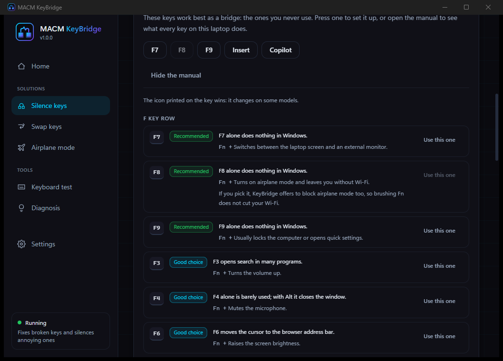
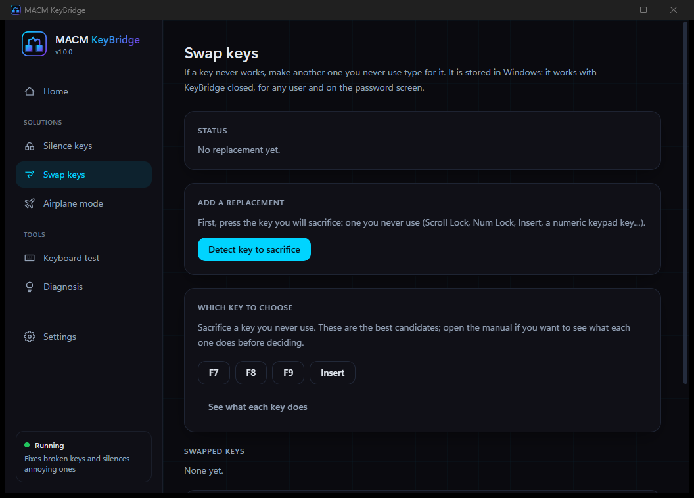
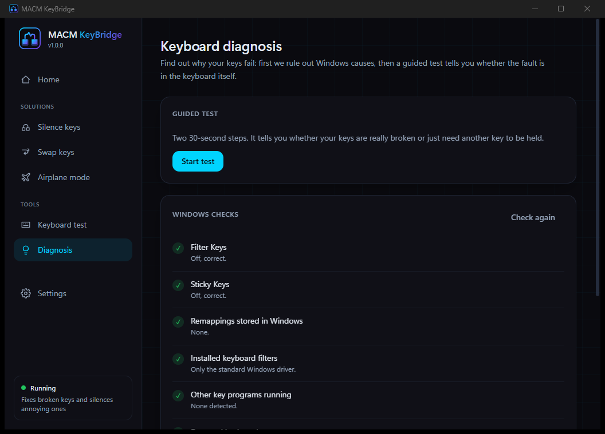

<div align="center">


# MACM KeyBridge — Fix Broken Laptop Keys & Silence Annoying Ones (Windows)

**For keyboards where some keys only work while another key is held down.** Silences the key you keep pressed, remaps dead keys permanently, blocks the airplane-mode key and tells you whether the fault is Windows or the keyboard itself. 100% offline.

[](https://github.com/m-a-c-m/macm-keybridge/releases/latest)
[](https://github.com/m-a-c-m/macm-keybridge/releases/latest)
[](https://tauri.app)
[](https://www.rust-lang.org)
[](https://react.dev)
[](https://www.typescriptlang.org)
[](PRIVACY.md)
[](LICENSE)

[**Download**](https://github.com/m-a-c-m/macm-keybridge/releases/latest) · [Who is it for](#-who-is-it-for) · [Features](#-features) · [Quick start](#-quick-start) · [How it works](#-how-it-works) · [Privacy](#-privacy) · [Documentación en español](docs/PROYECTO.md) · [miguelacm.es](https://miguelacm.es)

</div>



## 🧩 Who is it for

KeyBridge opens with one question — **"What is wrong with your keyboard?"** — and takes you straight to the fix:

| Your problem | What KeyBridge does | Needs the app running |
|---|---|---|
| **Some keys only work while I hold another one** | You wedge one key down and KeyBridge makes Windows ignore it completely | Yes |
| **Some keys never work** | A key you never use types for the broken one, system-wide | No |
| **A key annoys me** (Copilot, Windows key in games, Caps Lock, Insert…) | Makes it do nothing | Yes |
| **Airplane mode turns on by accident** | Blocks the keyboard's airplane-mode key, Wi-Fi untouched | No |
| **I don't know what is wrong** | Checks Windows and runs a 1-minute guided test with a verdict | — |

The first case is the one that started this project: on many laptops with a cracked keyboard trace, a whole column of keys (for example **3, E, D and C**) stops responding unless *any* other key is held down. The keyboard controller only scans that column while it is in continuous-scan mode, and it only enters that mode on a real, physical press. No program can press a key electrically for you — so KeyBridge takes the next best route: you hold the key with a wedge, and it makes that key completely invisible to Windows.

## ✨ Features

### Silence keys
- **Low-level keyboard hook** (`WH_KEYBOARD_LL`) on a dedicated thread with its own message loop, reinstalled every 60 s (new hook installed before the old one is removed) so Windows never silently drops it.
- A silenced key produces **nothing**: no repeats, no menus, no shortcuts, no window-manager side effects, however long it stays held.
- **Copilot key support** — the hardware emits `LWin + LShift + F23`; KeyBridge buffers `LWin` for ~35 ms to recognise the sequence, so the real Windows key keeps working.
- **Out-of-process engine** — the hook lives in a windowless child process (`--engine`, JSON-lines IPC, respawned in 1 s if it dies). Windows stops delivering hook callbacks while the app's own WebView window has focus; measured 0 events before the split, 20/20 after.
- Per-key toggles, pause for 1/5/15/60 minutes or until resumed, and a global pause hotkey (`Ctrl + Alt + B` by default).

### Swap keys (permanent)
- Writes the documented **Scancode Map** in `HKLM\SYSTEM\CurrentControlSet\Control\Keyboard Layout`, so a key you never use types the broken one **with KeyBridge closed, for every user and on the sign-in screen**.
- Asks for administrator rights once, needs one restart, and removes itself cleanly — byte-for-byte verified against the format Microsoft documents.
- Warns if another program already owns the map instead of silently overwriting it.

### Airplane-mode key
- On most laptops `Fn + F8` never reaches Windows as a key: it travels as a **Wireless Radio Controls** HID collection (`HID_DEVICE_UP:0001_U:000C`). No key blocker can stop it.
- KeyBridge disables exactly that collection through SetupAPI — the same as *Disable device* in Device Manager — and refuses to touch anything else. Keyboard, Wi-Fi, Bluetooth and the Windows airplane-mode toggle keep working.
- Remembers which devices *it* disabled, so it never re-enables something you disabled yourself, and detects when a Windows update switched it back on.

### Diagnosis
- One-click checks for the usual software causes: **Filter Keys**, **Sticky Keys**, a foreign **Scancode Map**, third-party **keyboard filter drivers**, other remapping apps running, disabled keyboards and your BIOS version.
- **Guided 2-step test**: press the failing keys alone, then again while holding another key. You get a verdict — *physical fault* / *no fault found* / *dead keys* — with ranked next steps.
- **Diagnostic report** saved to your Desktop as plain text: Windows build, keyboards, checks and the keys you pressed during the test. Nothing is uploaded.

### Key manual
- 28 bilingual key cards: what each key does on its own, what it does with `Fn` on a laptop, and a rating as a bridge key and as a sacrificial key — plus warnings (keys that open the BIOS or the boot menu if held at power-on, the one that kills your Wi-Fi).
- Recommended keys are one click away; the full manual only opens if you ask for it.

### App
- **Setup assistant**, system tray, autostart as user or as administrator (scheduled task, works on battery), ES / EN, dark / light theme.
- **Home** states in plain sentences what is active right now — *"F8 does nothing", "Fn + F8 still turns on airplane mode", "KeyBridge does not open by itself"* — each with its own fix button.
- **Fully reversible**: per-feature undo, *Undo all system changes* in Settings, and the uninstaller runs the same cleanup automatically (skipped during updates).
- **Lightweight** — ~12 MB of RAM for the UI plus ~4 MB for the engine, no background CPU use, single portable `.exe` or a 2 MB installer.

| Silence keys | Key manual |
|---|---|
|  |  |

| Swap keys | Diagnosis |
|---|---|
|  |  |

## 🚀 Quick start

### Install (users)
1. Download **`MACM.KeyBridge_x.y.z_x64-setup.exe`** from the [latest release](https://github.com/m-a-c-m/macm-keybridge/releases/latest), or the portable `.exe` if you prefer not to install anything.
2. Optional — verify the download against `SHA256SUMS.txt`:
   ```powershell
   Get-FileHash .\MACM.KeyBridge_1.0.0_x64-setup.exe -Algorithm SHA256
   ```
3. Run it. If Windows SmartScreen shows *"Windows protected your PC"* (common for new apps without a commercial code-signing certificate), click **More info → Run anyway**.

Requirements: Windows 10 (1809+) or 11, x64. WebView2 ships with Windows 11; the installer adds it on Windows 10 if missing.

### Fix a keyboard whose keys need another key held (2 minutes)
1. Open KeyBridge and pick **"Some keys only work while I hold another one"**.
2. Choose the key you will sacrifice — the Copilot key, `F7`, `F8`, `F9` or `Insert` are the usual suspects. The built-in manual tells you what each one does first.
3. If you picked the airplane-mode key, block it too with the button that appears.
4. Wedge that key down for real: a folded piece of paper, a sliver of rubber, a drop of tape. **This part is physical — software cannot press a key for you.**
5. Type. Everything works, and the wedged key does nothing.
6. Turn on *Open KeyBridge when the computer starts* so it is there after every reboot.

### Build from source (developers)
Requirements: [Rust](https://rustup.rs) stable, [Node.js](https://nodejs.org) 20+, Visual Studio Build Tools 2022 (C++ desktop workload), WebView2 Runtime.

```bash
npm install
npm run tauri dev      # development with hot reload
npm run tauri build    # portable .exe and NSIS installer in src-tauri/target/release/
```

Quality checks:

```bash
npx tsc --noEmit
cargo clippy --manifest-path src-tauri/Cargo.toml --all-targets -- -D warnings
cargo test --manifest-path src-tauri/Cargo.toml
```

## 🔧 How it works

```
macm-keybridge.exe                  UI process (Tauri 2 + React)
 └── macm-keybridge.exe --engine    engine process, no windows, ~4 MB
      └── WH_KEYBOARD_LL hook on its own thread with a message loop
 └── macm-keybridge.exe --radio     elevated helper: enables/disables the radio HID collection
 └── macm-keybridge.exe --remap     elevated helper: writes/clears the Scancode Map
 └── macm-keybridge.exe --cleanup   undoes everything (run by the uninstaller)
```

What software **cannot** do, stated plainly: it cannot close a broken circuit, cannot put the keyboard controller into continuous-scan mode, and cannot act on the sign-in screen or the UAC secure desktop. `SendInput` injects into Windows, not into the keyboard matrix. Everything KeyBridge does happens *after* the controller has already read the key.

Measurements, decisions and the full reasoning: [docs/PROYECTO.md](docs/PROYECTO.md) (Spanish).

## 🔒 Privacy

> **100% local · offline · no telemetry · no accounts · open source**

- Sends no data anywhere. No analytics, crash reports, identifiers or updater.
- The UI **cannot** make network requests: its CSP only allows `ipc:`.
- The keyboard hook exists to *block* keys. Keystrokes are counted, never stored; the live key view used by the tester and the capture dialog is a short in-memory ring buffer that is dropped when you leave the screen, and the diagnostic report only contains what you pressed during the guided test, saved to your own Desktop.
- Your settings are readable JSON in `%APPDATA%\es.miguelacm.keybridge\`.

Details and how to verify it yourself: [PRIVACY.md](PRIVACY.md). Security policy: [SECURITY.md](SECURITY.md).

## 🛠 Tech stack

- **Tauri 2** — native shell, installer, tray
- **Rust** — hook engine, Win32 backend (`windows-rs`: `WH_KEYBOARD_LL`, `SendInput`, SetupAPI, registry, scheduled tasks), elevated helpers
- **React 19 + TypeScript** (strict) + **Vite**, **Tailwind CSS 4**
- Rust unit tests for the blocking logic and the Scancode Map layout; GitHub Actions release pipeline with SHA-256 checksums

## ⚠️ Honest limitations

- The held key has to be held **physically**. KeyBridge removes its side effects; it cannot create the press.
- Silencing keys needs KeyBridge running. Swapped keys and the airplane-mode block live in Windows and survive with it closed.
- Without administrator rights, silenced keys come back while an elevated window is in front (Task Manager, installers). Autostart as administrator fixes that.
- Swapping keys applies to every keyboard on the machine, including external ones, and needs a restart to apply or to undo.
- A damaged keyboard is still damaged. KeyBridge makes it usable; it does not repair it.

## 📄 License

[MIT](LICENSE) © 2026 Miguel Ángel Colorado Marin (MACM). Terms of use: [TERMS.md](TERMS.md). Want to contribute? [CONTRIBUTING.md](CONTRIBUTING.md).

---

<div align="center">

Made by **MACM** · [miguelacm.es](https://miguelacm.es) · More free tools at [miguelacm.es/tools](https://miguelacm.es/tools)

</div>
